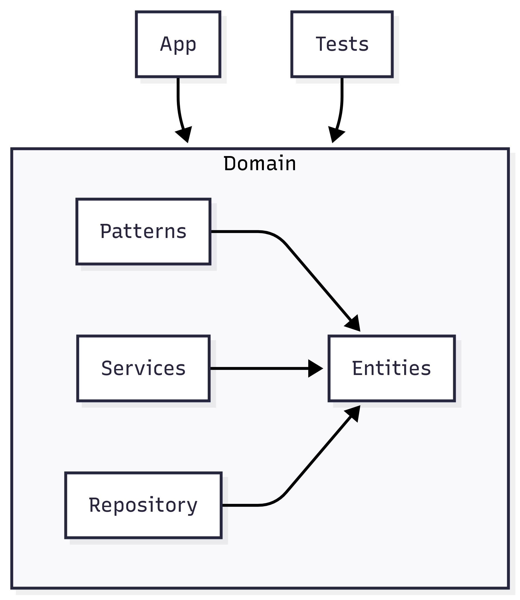
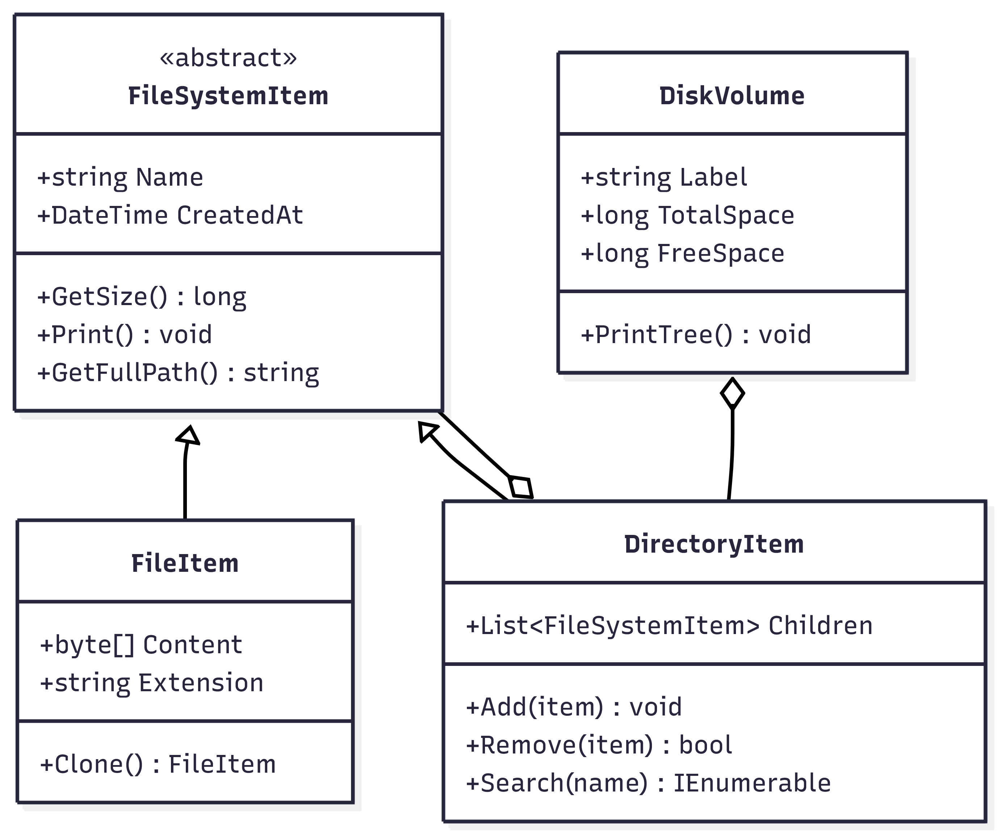
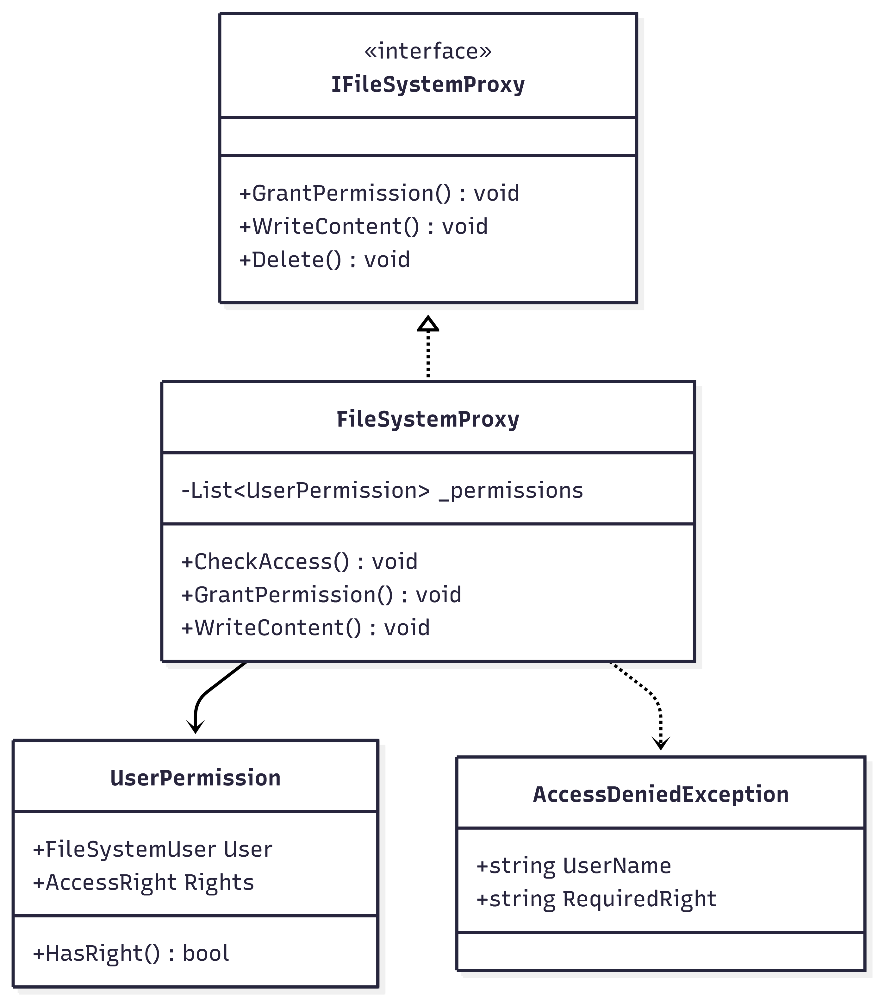
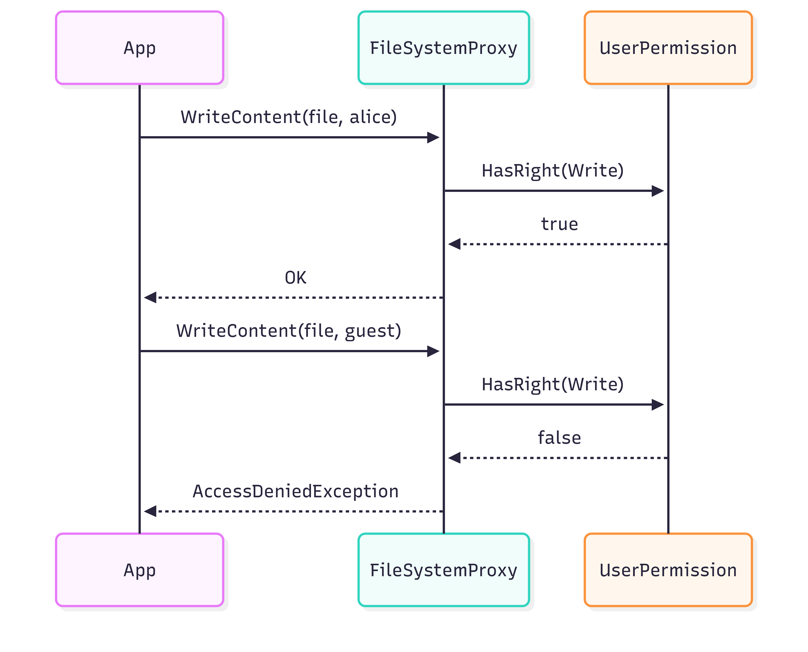
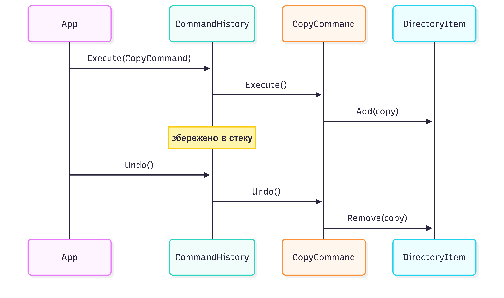

# File System Emulator

Емулятор файлової системи з древовидною структурою та контролем доступу.
Демонструє паттерни Composite, Command та Proxy.

## Можливості

- Ієрархія файлів та каталогів з рекурсивними операціями
- Копіювання, переміщення, видалення з Undo (до 20 операцій)
- Контроль доступу з ролями (Адміністратор, Користувач, Гість)
- Пошук файлів по імені та розширенню
- Серіалізація структури та команд у JSON

## Архітектура

```
FileSystemEmulator.Domain/
├── Entities/ (FileItem, DirectoryItem, DiskVolume, користувачі та ролі)
├── Interfaces/ (IFileSystemItem, ISearchable, IPrintable)
├── Patterns/
│   ├── Command/ (CopyCommand, MoveCommand, DeleteCommand, CommandHistory)
│   ├── Composite/ (древовидна ієрархія)
│   └── Proxy/ (FileSystemProxy з перевіркою прав)
├── Repository/ (FileSystemRepository<T>)
├── Services/ (QueryService для пошуку, SerializationService)
└── Exceptions/ (власні винятки)

FileSystemEmulator.App/
└── Program.cs (демонстрація)

FileSystemEmulator.Tests/
└── xUnit тести з Moq
```



## Збирання та запуск

### Вимоги

- .NET 8 SDK
- xUnit
- Moq

### Збирання

```bash
dotnet build
```

### Запуск програми

```bash
dotnet run --project FileSystemEmulator.App
```

### Запуск тестів

```bash
dotnet test
```

## Бізнес-правила

### Файли та каталоги

1. Файл містить ім'я, розширення, розмір та дату створення
2. Каталог містить файли та інші каталоги (паттерн Composite)
3. Видалення каталога видаляє всі вложені елементи
4. Копіювання створює нову ієрархію з новими ID



### Права доступу

1. Користувач має роль та набір прав (Read, Write, Execute, Delete)
2. FileSystemProxy перевіряє права перед операцією
3. Адміністратор має всі права без обмежень
4. Гість має тільки права на читання
5. Заборонені операції кидають AccessDeniedException




### Команди з undo

1. Операції Copy, Move, Delete реалізують ICommand
2. CommandHistory зберігає до 20 команд в стеку
3. Undo скасовує операцію та відновлює стан
4. Кожна команда може бути скасована



## Документація

- [Послідовність серіалізації](docs/06-serialization-sequence.png)
- [Архітектура](docs/architecture.md)
- [Стратегія тестування](docs/test-strategy.md)
- [Результати тестів](docs/TESTING.md)
