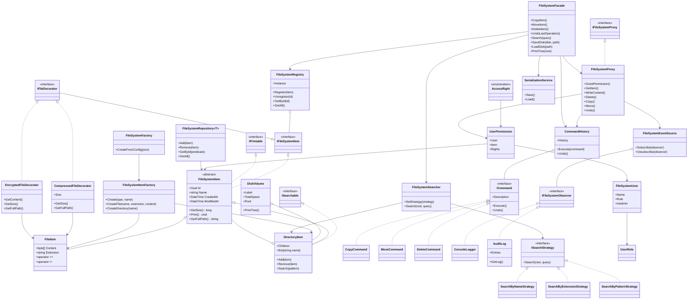

# FileSystemEmulator Class Diagram

```mermaid
classDiagram
    class IFileSystemItem {
        <<interface>>
    }
    class IPrintable {
        <<interface>>
    }
    class ISearchable {
        <<interface>>
    }
    class FileSystemItem {
        <<abstract>>
        +Guid Id
        +string Name
        +DateTime CreatedAt
        +DateTime ModifiedAt
        +GetSize() long
        +Print() void
        +GetFullPath() string
    }
    class FileItem {
        +byte[] Content
        +string Extension
        +operator ==
        +operator !=
    }
    class DirectoryItem {
        +Children
        +this[string name]
        +Add(item)
        +Remove(item)
        +Search(pattern)
    }
    class DiskVolume {
        +Label
        +TotalSpace
        +Root
        +PrintTree()
    }
    class FileSystemUser {
        +Name
        +Role
        +IsAdmin
    }
    class UserPermission {
        +User
        +Item
        +Rights
    }
    class AccessRight {
        <<enumeration>>
    }
    class ICommand {
        <<interface>>
        +Execute()
        +Undo()
        +Description
    }
    class CopyCommand
    class MoveCommand
    class DeleteCommand
    class CommandHistory {
        +Execute(command)
        +Undo()
        +History
    }
    class IFileSystemProxy {
        <<interface>>
    }
    class FileSystemProxy {
        +GrantPermission()
        +GetItem()
        +WriteContent()
        +Delete()
        +Copy()
        +Move()
        +Undo()
    }
    class FileSystemRepository~T~ {
        +Add(item)
        +Remove(item)
        +GetById(predicate)
        +GetAll()
    }
    class FileSystemItemFactory {
        +Create(type, name)
        +CreateFile(name, extension, content)
        +CreateDirectory(name)
    }
    class FileSystemFactory {
        +CreateFromConfig(json)
    }
    class FileSystemRegistry {
        +Instance
        +Register(item)
        +Unregister(id)
        +GetById(id)
        +GetAll()
    }
    class IFileSystemObserver {
        <<interface>>
    }
    class FileSystemEventSource {
        +Subscribe(observer)
        +Unsubscribe(observer)
    }
    class ConsoleLogger
    class AuditLog {
        +Entries
        +GetLog()
    }
    class ISearchStrategy {
        <<interface>>
        +Search(root, query)
    }
    class SearchByNameStrategy
    class SearchByExtensionStrategy
    class SearchByPatternStrategy
    class FileSystemSearcher {
        +SetStrategy(strategy)
        +Search(root, query)
    }
    class IFileDecorator {
        <<interface>>
    }
    class CompressedFileDecorator {
        +Size
        +GetSize()
        +GetFullPath()
    }
    class EncryptedFileDecorator {
        +GetContent()
        +GetSize()
        +GetFullPath()
    }
    class SerializationService {
        +Save()
        +Load()
    }
    class FileSystemFacade {
        +CopyItem()
        +MoveItem()
        +DeleteItem()
        +UndoLastOperation()
        +Search(query)
        +SaveDisk(disk, path)
        +LoadDisk(path)
        +PrintTree(root)
    }

    IFileSystemItem <|.. FileSystemItem
    IPrintable <|.. FileSystemItem
    ISearchable <|.. DirectoryItem
    FileSystemItem <|-- FileItem
    FileSystemItem <|-- DirectoryItem
    DiskVolume o-- DirectoryItem
    DirectoryItem o-- FileSystemItem
    FileSystemUser --> UserRole
    UserPermission --> FileSystemUser
    UserPermission --> FileSystemItem
    AccessRight --> UserPermission

    ICommand <|.. CopyCommand
    ICommand <|.. MoveCommand
    ICommand <|.. DeleteCommand
    CommandHistory o-- ICommand

    IFileSystemProxy <|.. FileSystemProxy
    FileSystemProxy --> UserPermission
    FileSystemProxy --> CommandHistory
    FileSystemProxy --> FileSystemEventSource

    FileSystemRepository~T~ --> FileSystemItem
    FileSystemItemFactory --> FileItem
    FileSystemItemFactory --> DirectoryItem
    FileSystemFactory --> FileSystemItemFactory
    FileSystemRegistry o-- IFileSystemItem

    IFileSystemObserver <|.. ConsoleLogger
    IFileSystemObserver <|.. AuditLog
    FileSystemEventSource o-- IFileSystemObserver

    ISearchStrategy <|.. SearchByNameStrategy
    ISearchStrategy <|.. SearchByExtensionStrategy
    ISearchStrategy <|.. SearchByPatternStrategy
    FileSystemSearcher --> ISearchStrategy
    FileSystemSearcher --> DirectoryItem

    IFileDecorator --|> IFileSystemItem
    IFileDecorator <|.. CompressedFileDecorator
    IFileDecorator <|.. EncryptedFileDecorator
    CompressedFileDecorator --> FileItem
    EncryptedFileDecorator --> FileItem

    FileSystemFacade --> FileSystemProxy
    FileSystemFacade --> FileSystemSearcher
    FileSystemFacade --> SerializationService
    FileSystemFacade --> CommandHistory
    FileSystemFacade --> FileSystemRegistry
```

