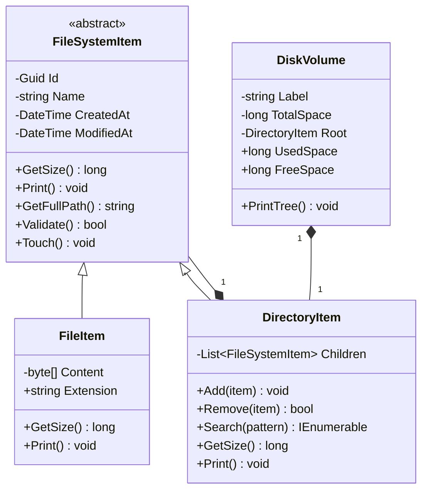
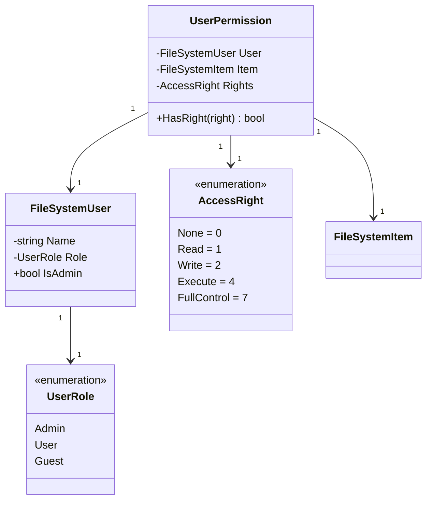
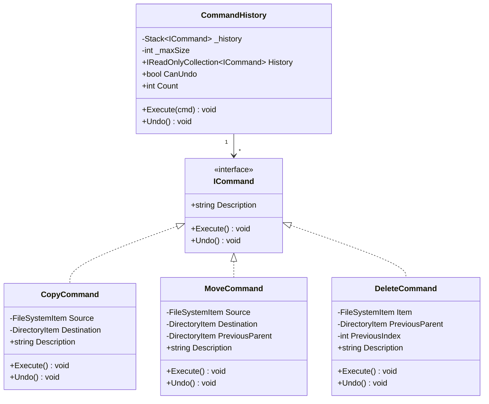
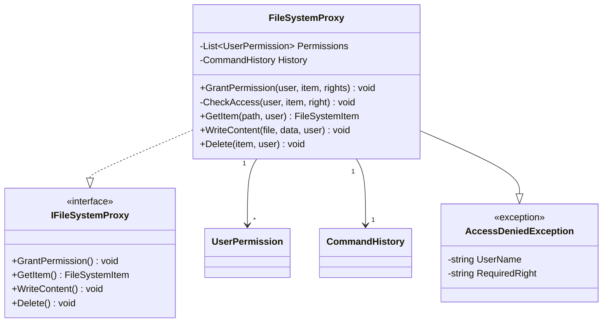
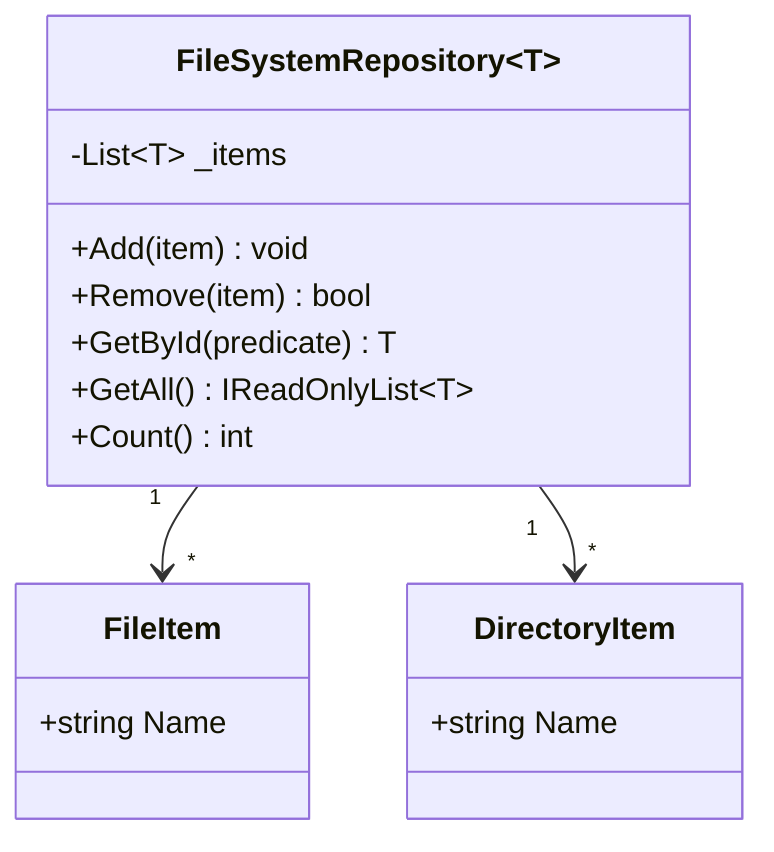
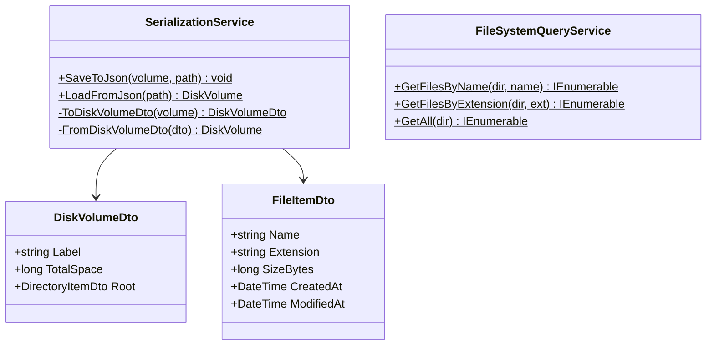

# Class Diagram - FileSystem Emulator

## 1. UML - Основні сутності (Entities)



## 2. UML - Користувачі та права доступу (Access Control)



## 3. UML - Command Pattern (Command, Move, Delete)



## 4. UML - Proxy Pattern (Access Control)



## 5. UML - Repository (Generic pattern)



## 6. UML - Services (Serialization + Query)



## Patternи та принципи

### Composite Pattern
- **FileSystemItem** - абстрактна база
- **FileItem** - листок (файл)
- **DirectoryItem** - контейнер (рекурсивна ієрархія)

### Command Pattern
- **ICommand** - інтерфейс команди
- **CopyCommand, MoveCommand, DeleteCommand** - конкретні команди
- **CommandHistory** - управління історією (стек)

### Proxy Pattern
- **FileSystemProxy** - контролює доступ
- **UserPermission** - зберігає права
- **AccessDeniedException** - обробка помилок

### Generic Repository Pattern
- **FileSystemRepository<T>** - універсальне сховище
- Типова вибір: FileItem, DirectoryItem
└────────────────┘
```

### User & Permissions Layer

```
┌─────────────────┐          ┌──────────────────┐
│ FileSystemUser  │          │   UserRole       │
├─────────────────┤          ├──────────────────┤
│ -username       │          │ Admin = 0        │
│ -role: UserRole │◄─────────│ User = 1         │
│ -id: Guid       │          │ Guest = 2        │
├─────────────────┤          └──────────────────┘
│ + GetRole()     │
│ + SetRole()     │
└─────────────────┘

┌──────────────────┐          ┌────────────────┐
│ UserPermission   │          │  AccessRight   │
├──────────────────┤          ├────────────────┤
│ -user: User      │          │ Read = 1       │
│ -resource        │          │ Write = 2      │
│ -rights:         │◄─────────│ Execute = 4    │
│   AccessRight    │          │ Delete = 8     │
├──────────────────┤          └────────────────┘
│ + HasRight()     │
│ + GrantRight()   │
│ + RevokeRight()  │
└──────────────────┘
```

### Command Pattern Layer

```
            <<interface>>
              ICommand
            ─────────────────
            + Execute(): void
            + Undo(): void
            ─────────────────
                △ (implement)
                │
    ┌───────────┼───────────┐
    │           │           │
┌──────────┐ ┌────────┐ ┌─────────┐
│CopyCmd   │ │MoveCmd │ │DeleteCmd│
├──────────┤ ├────────┤ ├─────────┤
│ -source  │ │-source │ │-item    │
│ -dest    │ │-from   │ │-parent  │
│ -newId   │ │-to     │ │         │
├──────────┤ ├────────┤ ├─────────┤
│Execute() │ │Execute│ │Execute()│
│Undo()    │ │Undo() │ │Undo()   │
└──────────┘ └────────┘ └─────────┘

┌─────────────────────┐
│ CommandHistory      │
├─────────────────────┤
│ -stack: ICommand[]  │
│ -maxSize: int = 20  │
│ -count: int         │
├─────────────────────┤
│ + Execute(cmd)      │
│ + Undo()            │
│ + CanUndo()         │
│ + Clear()           │
└─────────────────────┘
```

### Proxy Pattern Layer

```
        <<interface>>
      IFileSystemProxy
      ─────────────────────
      + CheckAccess()
      + GrantPermission()
      + Execute(command)
      ─────────────────────
              △ (implement)
              │
       ┌──────┴──────┐
       │             │
    ┌──────────────┐ ┌──────────────────┐
    │FileSystemProxy│ │FileSystemItem    │
    ├──────────────┤ │(Real Subject)    │
    │ -history     │ │                  │
    │ -permissions │ │                  │
    │ -fileSystem  │◄──────────────────┤
    ├──────────────┤ │                  │
    │ CheckAccess()│ │                  │
    │ GrantPerm()  │ └──────────────────┘
    │ Execute()    │
    └──────────────┘
```

### Services Layer

```
┌──────────────────────┐
│FileSystemQueryService│
├──────────────────────┤
│ + GetLargestFiles()  │
│ + GetByExtension()   │
│ + GetTotalSize()     │
│ + GetRecent()        │
│ + GetAllFiles()      │
└──────────────────────┘

┌──────────────────────┐
│SerializationService  │
├──────────────────────┤
│ + SaveToJson(disk)   │
│ + LoadFromJson()     │
│ + ToDto()            │
│ + FromDto()          │
└──────────────────────┘

┌─────────────────────────────┐
│FileSystemRepository<T>      │
├─────────────────────────────┤
│ -items: List<T>             │
├─────────────────────────────┤
│ + Add(item)                 │
│ + GetById(id)               │
│ + GetAll()                  │
│ + Remove(item)              │
│ + Update(item)              │
└─────────────────────────────┘
```

## Діаграма Зв'язків (Relationships)

```
Dependencies:

Program.cs (Application)
    │
    ├─ uses ──► FileSystemQueryService
    │
    ├─ uses ──► SerializationService
    │
    ├─ uses ──► FileSystemProxy
    │           └─ uses ──► ICommand
    │                      └─ uses ──► CommandHistory
    │                      └─ uses ──► FileSystemItem
    │
    ├─ uses ──► DiskVolume
    │           └─ contains ──► DirectoryItem
    │                          └─ contains ──► FileSystemItem
    │
    ├─ uses ──► FileSystemUser
    │
    └─ uses ──► UserPermission


Inheritance:

FileSystemItem (abstract)
    ├─ FileItem
    └─ DirectoryItem
        └─ implements ISearchable

UserRole (enum)

AccessRight (flags enum)
```

## Текстова UML Діаграма (ASCII Art)

```
┌─────────────────────────────────────────────────────────────┐
│                   FileSystem Emulator                       │
│                   Architecture                              │
└─────────────────────────────────────────────────────────────┘

┌──────────────────────────────────────────────────────────────┐
│ Presentation Layer: Program.cs                               │
│ - Демонстрація функціональності                              │
│ - Консольний інтерфейс                                       │
└───────────────────┬──────────────────────────────────────────┘
                    │
    ┌───────────────┼───────────────┐
    │               │               │
┌───▼────────┐  ┌──▼──────┐  ┌─────▼───────┐
│Services    │  │Patterns │  │Entities     │
│            │  │         │  │             │
│QueryService│  │Command  │  │FileItem     │
│Serializ.   │  │Proxy    │  │DirectoryItem│
│Repository  │  │Composite│  │DiskVolume   │
└────────────┘  └─────────┘  └─────────────┘

┌──────────────────────────────────────────────────────────────┐
│ Domain Layer                                                 │
└──────────────────────────────────────────────────────────────┘

┌──────────────────────────────────────────────────────────────┐
│ Test Layer: FileSystemEmulator.Tests                         │
│ - 27 xUnit тестів                                            │
│ - ~90% покриття                                              │
└──────────────────────────────────────────────────────────────┘
```

## Інтерфейси

```
IFileSystemItem
├─ GetSize(): long
├─ Print(): void
├─ GetCreatedDate(): DateTime
└─ GetModifiedDate(): DateTime

ISearchable (реалізовано в DirectoryItem)
└─ Search(pattern): IEnumerable<FileSystemItem>

IPrintable (реалізовано в всіх Entity)
└─ Print(): void

ICommand
├─ Execute(): void
└─ Undo(): void

IFileSystemProxy
├─ CheckAccess(user, resource, right): bool
├─ GrantPermission(permission): void
└─ Execute(command): void
```

## Comparison Matrix

| Класс | Батько | Інтерфейси | Кількість методів |
|-------|--------|-----------|-----------------|
| FileItem | FileSystemItem | IFileSystemItem, IPrintable | 5 |
| DirectoryItem | FileSystemItem | IFileSystemItem, ISearchable, IPrintable | 8 |
| DiskVolume | - | IPrintable | 4 |
| FileSystemUser | - | - | 2 |
| CopyCommand | - | ICommand | 2 |
| MoveCommand | - | ICommand | 2 |
| DeleteCommand | - | ICommand | 2 |
| CommandHistory | - | - | 4 |
| FileSystemProxy | - | IFileSystemProxy | 3 |

## Структура Модулів

```
FileSystemEmulator.Domain/
├── Entities/ (8 classes)
├── Interfaces/ (3 interfaces)
├── Patterns/ (7 classes implementing 3 patterns)
├── Repository/ (1 generic class)
├── Services/ (3 service classes)
└── Exceptions/ (1 custom exception file)

Total: 23 classes, 3 interfaces, 6 exception types
```

## Висновок

Архітектура забезпечує:
- ✓ Чітке розділення відповідальності
- ✓ Легку розширюваність через паттерни
- ✓ Правильне використання SOLID принципів
- ✓ Підтримку складних операцій на ієрархічних структурах
