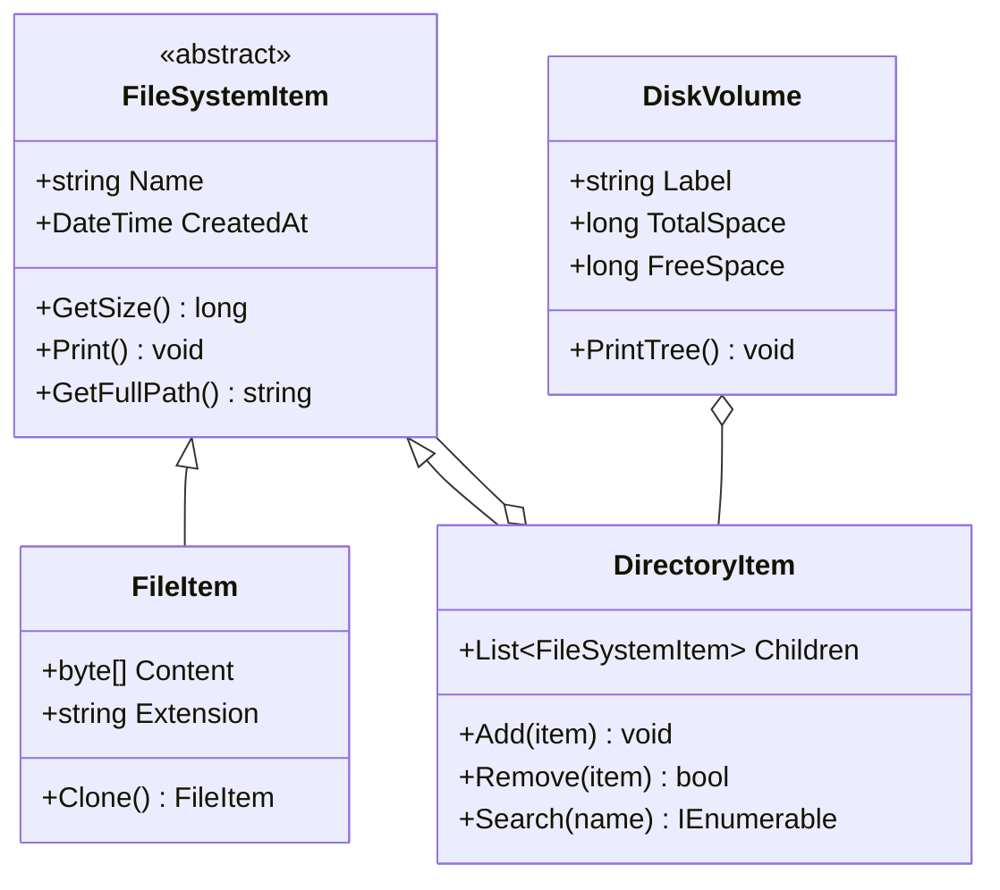
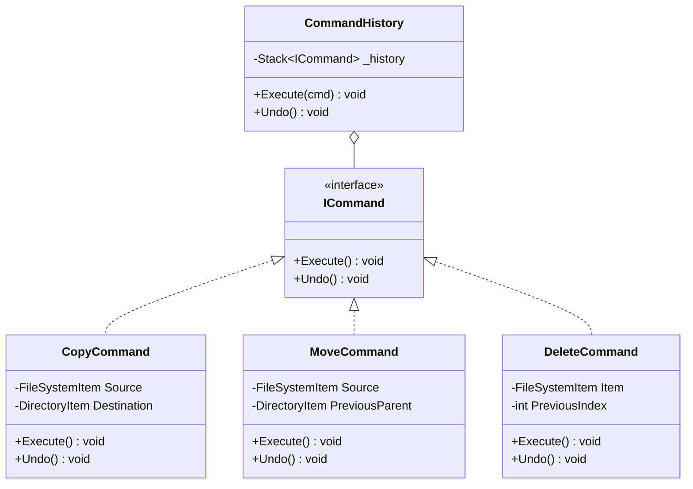
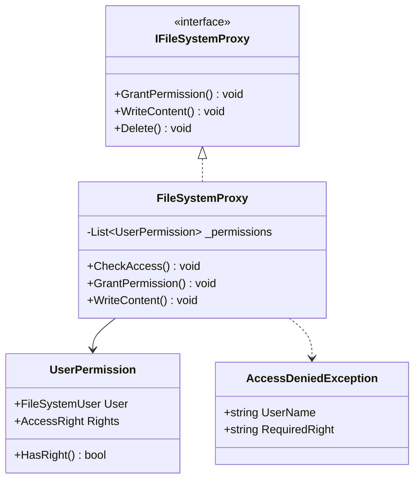

# Діаграма класів

## Сутності

```mermaid
classDiagram
    class FileSystemItem {
        <<abstract>>
        +string Name
        +DateTime CreatedAt
        +GetSize() long
        +Print() void
        +GetFullPath() string
    }
    class FileItem {
        +byte[] Content
        +string Extension
        +Clone() FileItem
    }
    class DirectoryItem {
        +List~FileSystemItem~ Children
        +Add(item) void
        +Remove(item) bool
        +Search(name) IEnumerable
    }
    class DiskVolume {
        +string Label
        +long TotalSpace
        +long FreeSpace
        +PrintTree() void
    }
    FileSystemItem <|-- FileItem
    FileSystemItem <|-- DirectoryItem
    DiskVolume o-- DirectoryItem
    DirectoryItem o-- FileSystemItem
```

## Command Pattern

```mermaid
classDiagram
    class ICommand {
        <<interface>>
        +Execute() void
        +Undo() void
    }
    class CopyCommand {
        -FileSystemItem Source
        -DirectoryItem Destination
        +Execute() void
        +Undo() void
    }
    class MoveCommand {
        -FileSystemItem Source
        -DirectoryItem PreviousParent
        +Execute() void
        +Undo() void
    }
    class DeleteCommand {
        -FileSystemItem Item
        -int PreviousIndex
        +Execute() void
        +Undo() void
    }
    class CommandHistory {
        -Stack~ICommand~ _history
        +Execute(cmd) void
        +Undo() void
    }
    ICommand <|.. CopyCommand
    ICommand <|.. MoveCommand
    ICommand <|.. DeleteCommand
    CommandHistory o-- ICommand
```

## Proxy Pattern

```mermaid
classDiagram
    class IFileSystemProxy {
        <<interface>>
        +GrantPermission() void
        +WriteContent() void
        +Delete() void
    }
    class FileSystemProxy {
        -List~UserPermission~ _permissions
        +CheckAccess() void
        +GrantPermission() void
        +WriteContent() void
    }
    class UserPermission {
        +FileSystemUser User
        +AccessRight Rights
        +HasRight() bool
    }
    class AccessDeniedException {
        +string UserName
        +string RequiredRight
    }
    IFileSystemProxy <|.. FileSystemProxy
    FileSystemProxy --> UserPermission
    FileSystemProxy ..> AccessDeniedException
```

