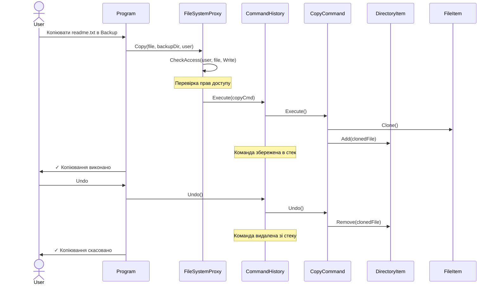
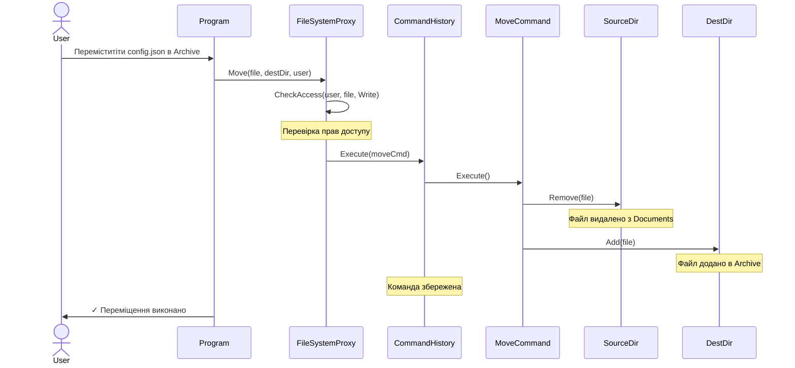
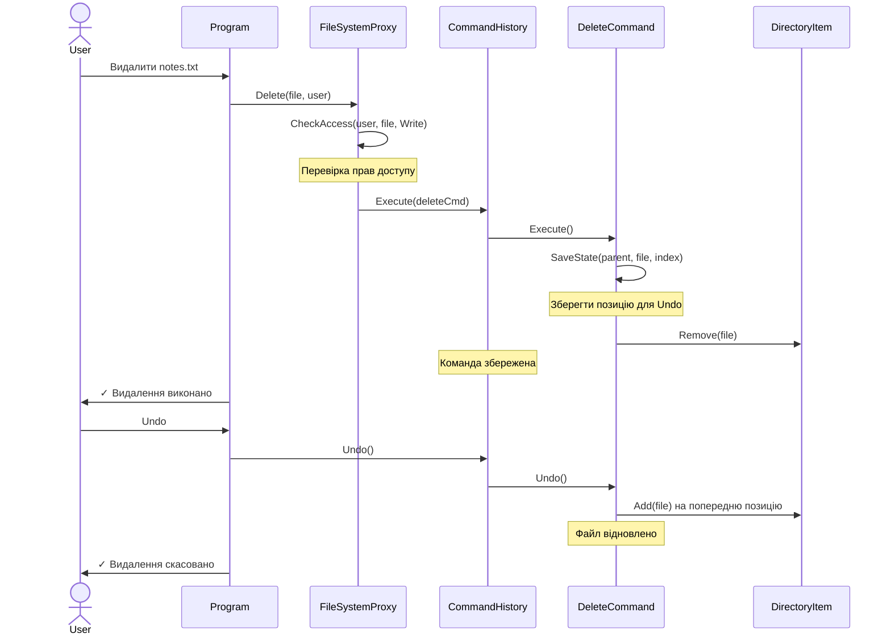
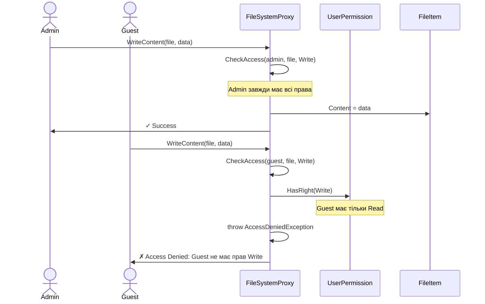
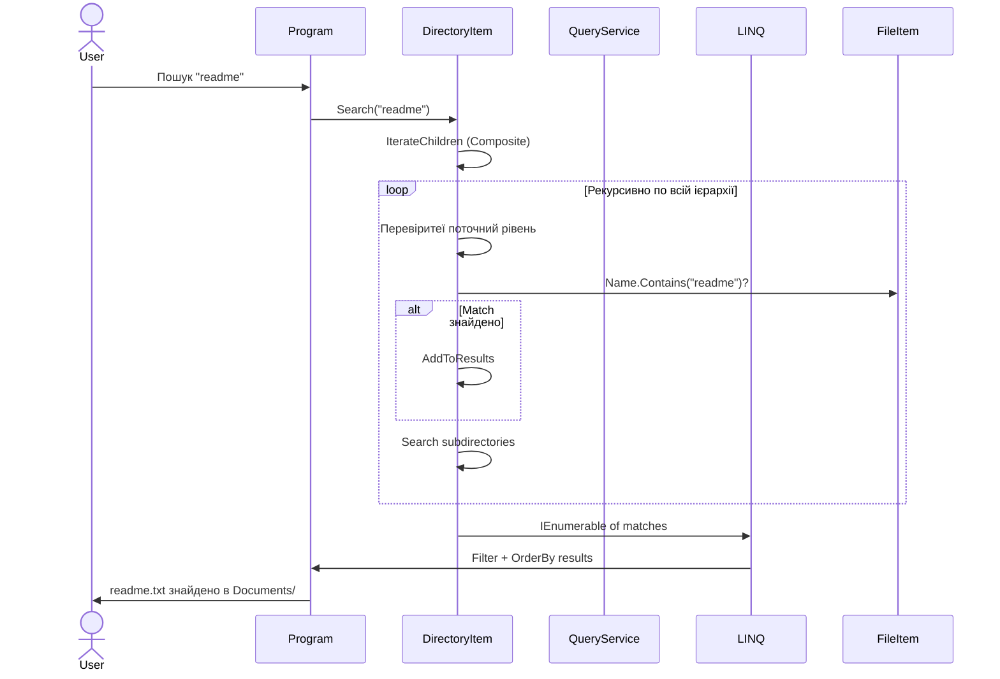
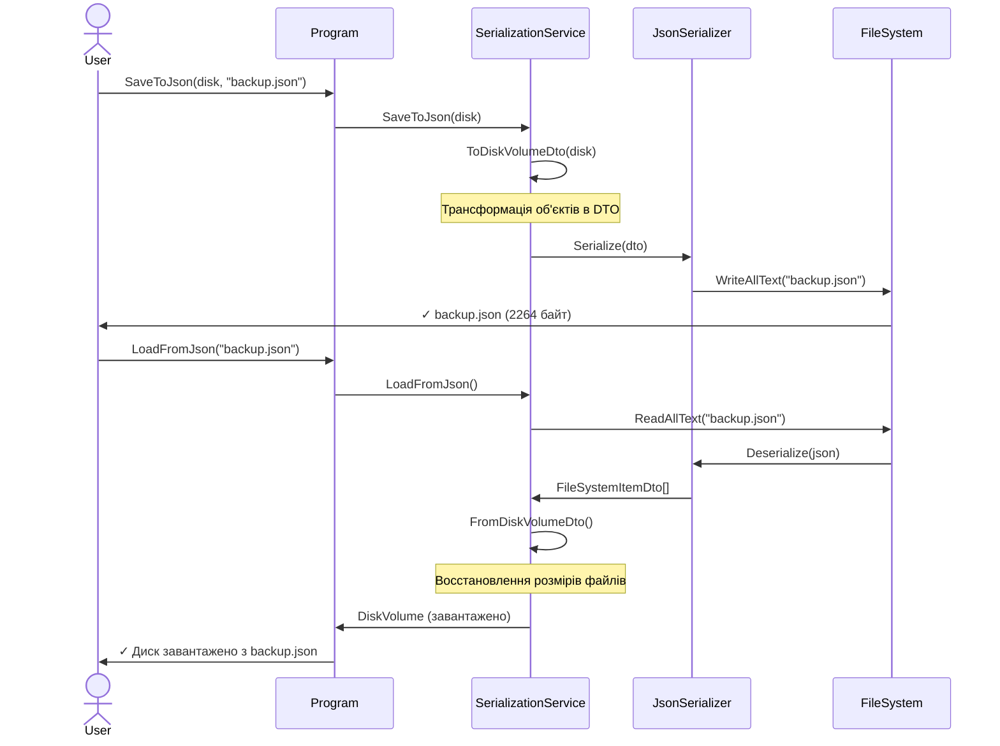

# Sequence Diagrams - FileSystem Emulator

## Diagram 1: Копіювання Файлу з Undo



## Diagram 2: Переміщення (Move) Файлу



## Diagram 3: Видалення (Delete) з Undo



## Diagram 4: Контроль Доступу - Proxy Pattern



## Diagram 5: Пошук Файлів (LINQ + Composite)



## Diagram 6: Серіалізація (Save/Load JSON)


DirectoryItem -> FileSystemQueryService: results = [file1, file2, ...]
FileSystemQueryService -> Program: IEnumerable<FileItem>
Program -> User: Found 3 matching files
```

## Diagram 5: Серіалізація

```
User -> Program: SaveToJson(disk)
Program -> SerializationService: SaveToJson(disk, "backup.json")
SerializationService -> SerializationService: CreateDto(disk)
SerializationService -> DiskVolume: GetRoot()
DiskVolume -> DirectoryItem: root
SerializationService -> FileSystemDtos: new DiskVolumeDto
FileSystemDtos -> FileSystemDtos: MapProperties()
FileSystemDtos -> FileSystemDtos: RecursivelyMapItems()
FileSystemDtos -> DirectoryItem: For each item
DirectoryItem -> FileItem: IsFile?
FileItem -> FileSystemDtos: Create FileItemDto
FileItemDto -> FileSystemDtos: SetName, SetSize, SetContent
FileSystemDtos -> DirectoryItem: IsDirectory?
DirectoryItem -> FileSystemDtos: Create DirectoryItemDto
DirectoryItemDto -> FileSystemDtos: SetName, SetItems (recursive)
FileSystemDtos -> FileSystemDtos: SerializeToJson()
FileSystemDtos -> System.Text.Json: JsonConvert
System.Text.Json -> FileSystemDtos: JSON string
FileSystemDtos -> SerializationService: json
SerializationService -> File: WriteAllText("backup.json", json)
File -> SerializationService: Success
SerializationService -> Program: Success
Program -> User: File saved to backup.json

// Завантаження
User -> Program: LoadFromJson("backup.json")
Program -> SerializationService: LoadFromJson("backup.json")
SerializationService -> File: ReadAllText("backup.json")
File -> SerializationService: json string
SerializationService -> System.Text.Json: JsonConvert
System.Text.Json -> FileSystemDtos: Deserialize
FileSystemDtos -> FileSystemDtos: CreateDomainObjects()
FileSystemDtos -> DiskVolume: new DiskVolume(dto.Name, dto.Capacity)
FileSystemDtos -> DirectoryItem: RecreateStructure()
DirectoryItem -> FileItem: RecreateFromDto()
FileItem -> DirectoryItem: item
DirectoryItem -> DiskVolume: root.Add(item)
SerializationService -> Program: DiskVolume loaded
Program -> User: Structure loaded from backup.json
```

## Diagram 6: Composition Pattern - Get Size

```
User -> Program: GetTotalSize(disk)
Program -> DiskVolume: GetSize()
DiskVolume -> DirectoryItem: root.GetSize()
DirectoryItem -> DirectoryItem: Calculate recursive size
DirectoryItem -> DirectoryItem: size = 0
DirectoryItem -> DirectoryItem: For each item
DirectoryItem -> FileItem: item1.GetSize()
FileItem -> FileItem: return contentSize (50 bytes)
FileItem -> DirectoryItem: 50
DirectoryItem -> DirectoryItem: size += 50
DirectoryItem -> DirectoryItem: Next item
DirectoryItem -> DirectoryItem: item2 is DirectoryItem?
DirectoryItem -> DirectoryItem: Call item2.GetSize() - Recursive
DirectoryItem -> FileItem: item2.1.GetSize()
FileItem -> DirectoryItem: 25
DirectoryItem -> DirectoryItem: size += 25
DirectoryItem -> DirectoryItem: item2.2.GetSize()
FileItem -> DirectoryItem: 30
DirectoryItem -> DirectoryItem: size += 30
DirectoryItem -> DirectoryItem: return 135 (to parent)
DirectoryItem -> DirectoryItem: size += 135
DirectoryItem -> DirectoryItem: Final size = 50 + 25 + 30 + 135 = 240
DirectoryItem -> DiskVolume: 240
DiskVolume -> Program: 240
Program -> User: Total size: 240 bytes
```

## Diagram 7: Обробка Команд у История

```
User Session:

Operation 1:
User -> Program: Copy(fileA, folderB)
Program -> CommandHistory: Execute(CopyCommand)
CommandHistory -> CopyCommand: Execute()
CopyCommand -> Program: Done
CommandHistory -> CommandHistory: stack[0] = CopyCommand

Operation 2:
User -> Program: Move(fileC, folderD)
Program -> CommandHistory: Execute(MoveCommand)
CommandHistory -> MoveCommand: Execute()
MoveCommand -> Program: Done
CommandHistory -> CommandHistory: stack[1] = MoveCommand

Operation 3:
User -> Program: Delete(fileE)
Program -> CommandHistory: Execute(DeleteCommand)
CommandHistory -> DeleteCommand: Execute()
DeleteCommand -> Program: Done
CommandHistory -> CommandHistory: stack[2] = DeleteCommand

Now: stack = [Copy, Move, Delete]

Undo Operation 1:
User -> Program: Undo()
Program -> CommandHistory: Undo()
CommandHistory -> CommandHistory: cmd = stack.pop()
CommandHistory -> DeleteCommand: Undo()
DeleteCommand -> Program: fileE restored
CommandHistory -> CommandHistory: stack = [Copy, Move]
Program -> User: Deleted operation undone

Undo Operation 2:
User -> Program: Undo()
Program -> CommandHistory: Undo()
CommandHistory -> CommandHistory: cmd = stack.pop()
CommandHistory -> MoveCommand: Undo()
MoveCommand -> Program: fileC moved back
CommandHistory -> CommandHistory: stack = [Copy]
Program -> User: Move operation undone
```

## Diagram 8: LINQ Query Example

```
User -> Program: GetLargestFiles(disk, 5)
Program -> FileSystemQueryService: GetLargestFiles(disk, 5)
FileSystemQueryService -> DirectoryItem: root.Search(all)
DirectoryItem -> DirectoryItem: RecursiveSearch()
DirectoryItem -> FileItem: fileA (100 bytes)
DirectoryItem -> FileItem: fileB (50 bytes)
DirectoryItem -> FileItem: fileC (200 bytes)
DirectoryItem -> FileItem: fileD (75 bytes)
DirectoryItem -> FileItem: fileE (150 bytes)
DirectoryItem -> FileSystemQueryService: [fileA, fileB, fileC, fileD, fileE]
FileSystemQueryService -> FileSystemQueryService: LINQ OrderByDescending
FileSystemQueryService -> FileSystemQueryService: .Take(5)
FileSystemQueryService -> FileSystemQueryService: results = [fileC(200), fileE(150), fileA(100), fileD(75), fileB(50)]
FileSystemQueryService -> Program: IEnumerable<FileItem>
Program -> Program: ForEach result
Program -> User: 
    1. fileC: 200 bytes
    2. fileE: 150 bytes
    3. fileA: 100 bytes
    4. fileD: 75 bytes
    5. fileB: 50 bytes
```

## Діаграма Станів - File Lifecycle

```
[Created]
   │
   ├─ Add to Directory ──────────► [In Directory]
   │                                  │
   │                                  ├─ Copy ──► [Copied] ──────► [In another Directory]
   │                                  │
   │                                  ├─ Move ──► [Moving] ──────► [In another Directory]
   │                                  │
   │                                  ├─ Search ──► [Found] ──────► [Query Result]
   │                                  │
   │                                  └─ Delete ──────────────────► [Deleted]
   │                                            │
   │                                            └─ Undo ──────────► [In Directory]
   │
   └─ Delete (before adding) ───────► [Garbage Collected]

States:
- Created: Object instantiated
- In Directory: Added to DirectoryItem.items
- Copied: Copy command executed
- Found: Search result returned
- Moving: Move command being executed
- Deleted: Removed from DirectoryItem.items
```

## Висновок

Діаграми послідовності показують:
- ✓ Взаємодія компонентів
- ✓ Flow контролю через систему
- ✓ Точки прийняття рішень
- ✓ Граничні умови обробки
- ✓ Рекурсивні операції
- ✓ Command паттерн застосування
- ✓ Proxy контроль доступу
- ✓ Composite рекурсія
