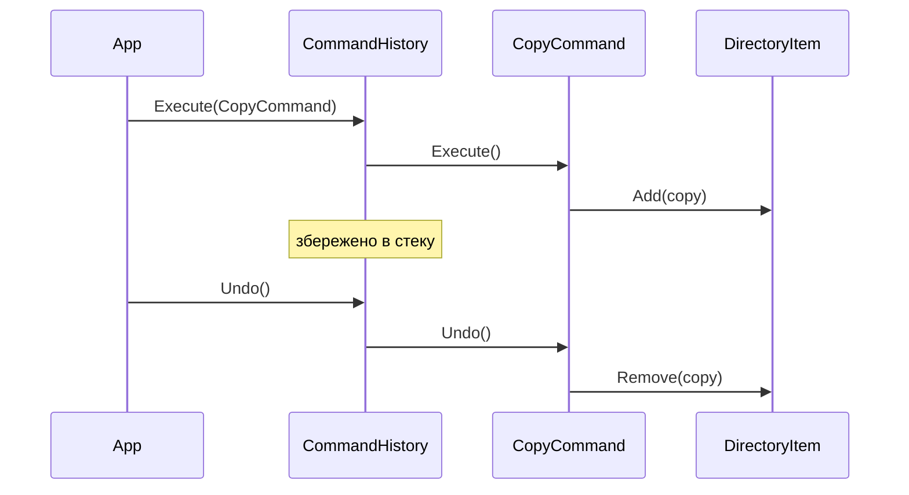
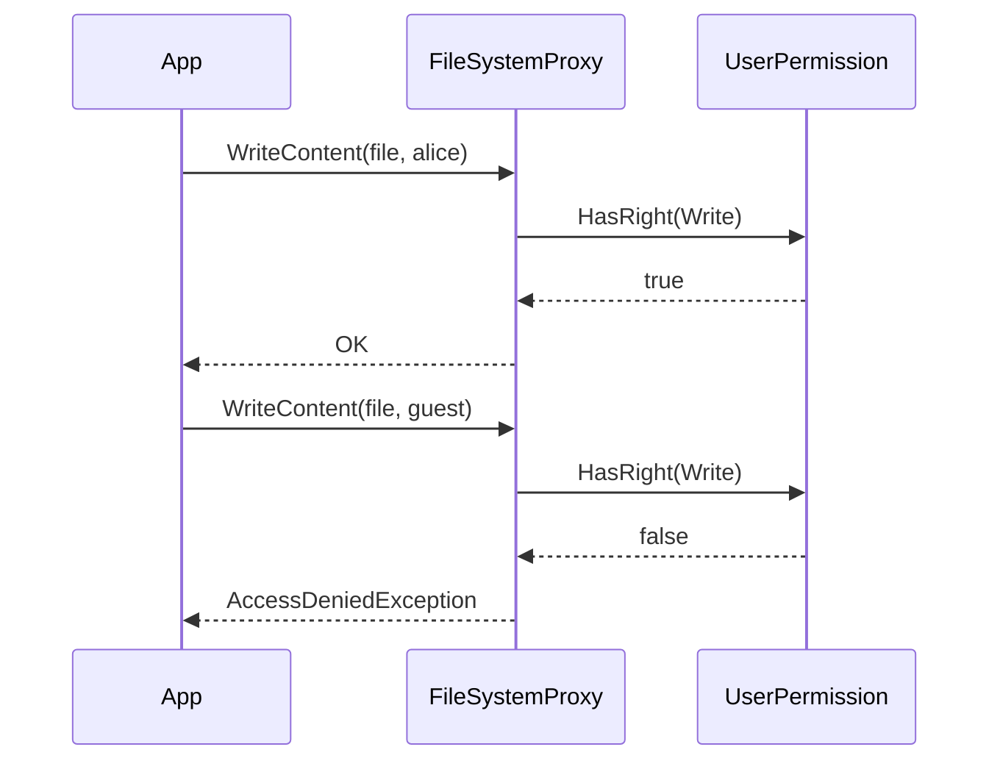
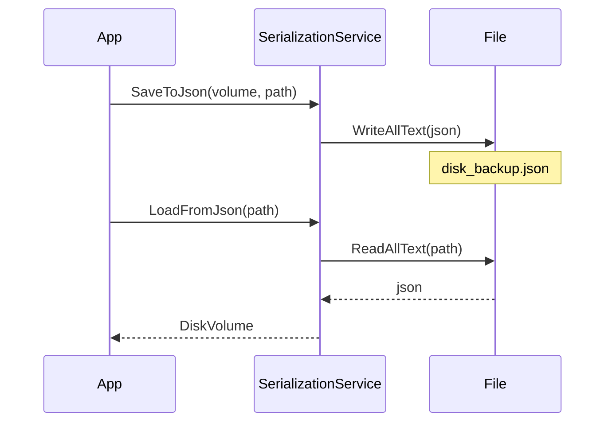

# Діаграми послідовностей

## Copy + Undo

```mermaid
sequenceDiagram
    participant App
    participant CommandHistory
    participant CopyCommand
    participant DirectoryItem
    App->>CommandHistory: Execute(CopyCommand)
    CommandHistory->>CopyCommand: Execute()
    CopyCommand->>DirectoryItem: Add(copy)
    Note over CommandHistory: збережено в стеку
    App->>CommandHistory: Undo()
    CommandHistory->>CopyCommand: Undo()
    CopyCommand->>DirectoryItem: Remove(copy)
```

## Proxy — контроль доступу

```mermaid
sequenceDiagram
    participant App
    participant FileSystemProxy
    participant UserPermission
    App->>FileSystemProxy: WriteContent(file, alice)
    FileSystemProxy->>UserPermission: HasRight(Write)
    UserPermission-->>FileSystemProxy: true
    FileSystemProxy-->>App: OK
    App->>FileSystemProxy: WriteContent(file, guest)
    FileSystemProxy->>UserPermission: HasRight(Write)
    UserPermission-->>FileSystemProxy: false
    FileSystemProxy-->>App: AccessDeniedException
```

## Серіалізація

```mermaid
sequenceDiagram
    participant App
    participant SerializationService
    participant File
    App->>SerializationService: SaveToJson(volume, path)
    SerializationService->>File: WriteAllText(json)
    Note over File: disk_backup.json
    App->>SerializationService: LoadFromJson(path)
    SerializationService->>File: ReadAllText(path)
    File-->>SerializationService: json
    SerializationService-->>App: DiskVolume
```
