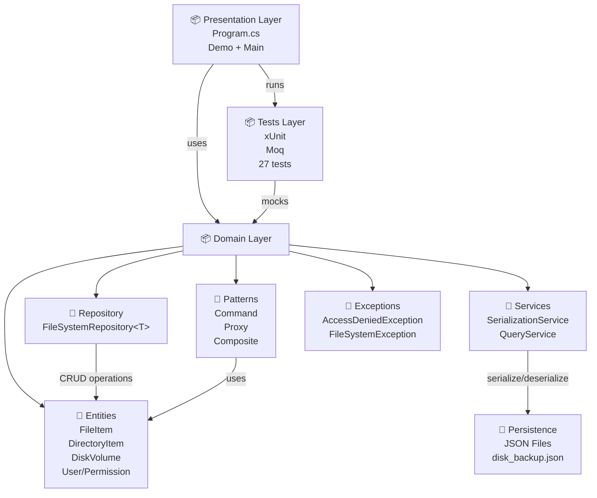
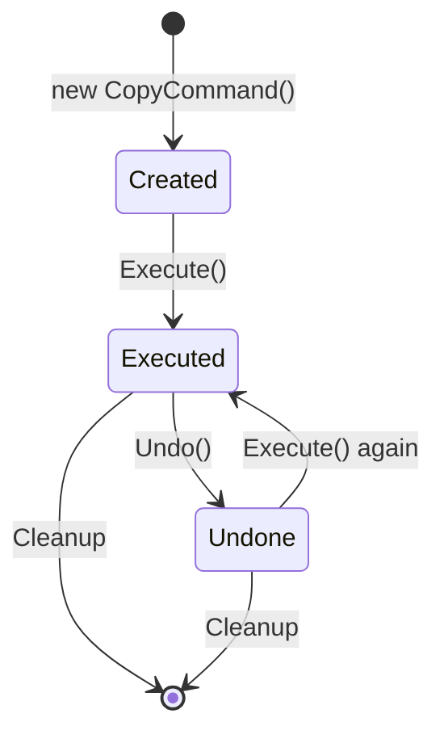
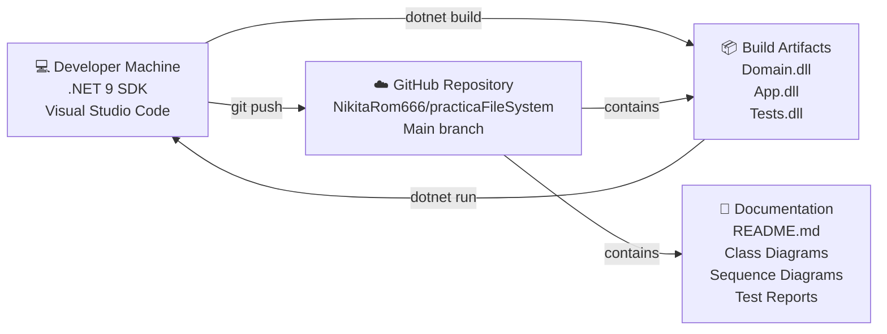
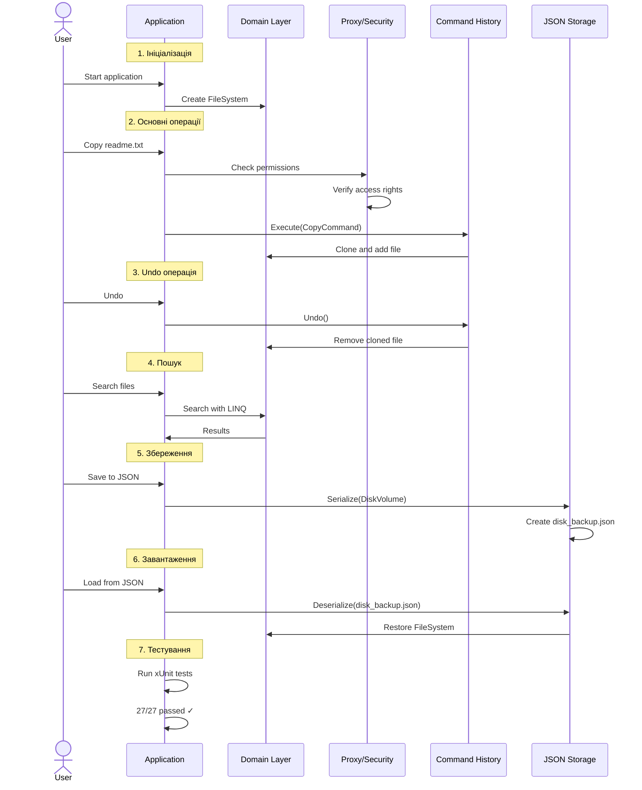
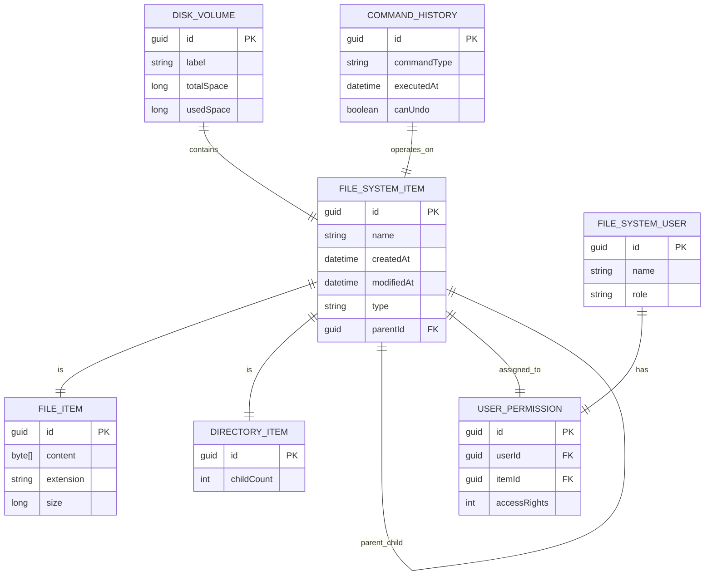
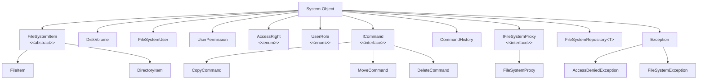
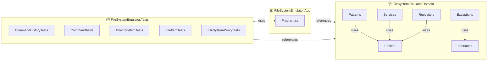

# UML Diagrams - FileSystem Emulator

## Component Diagram - Архітектура



## Use Case Diagram - Користувачи та операції

```mermaid
usecase UC1 as "Створити файл"
usecase UC2 as "Створити каталог"
usecase UC3 as "Копіювати файл/каталог"
usecase UC4 as "Переміститити файл/каталог"
usecase UC5 as "Видалити файл/каталог"
usecase UC6 as "Пошук файлів"
usecase UC7 as "Скасувати операцію (Undo)"
usecase UC8 as "Надати права доступу"
usecase UC9 as "Зберегти в JSON"
usecase UC10 as "Завантажити з JSON"
usecase UC11 as "Перевірити систему"

actor Admin as "Адміністратор\n(Всі права)"
actor User as "Звичайний користувач\n(Читання/Запис)"
actor Guest as "Гість\n(Тільки читання)"

Admin --> UC1
Admin --> UC2
Admin --> UC3
Admin --> UC4
Admin --> UC5
Admin --> UC6
Admin --> UC7
Admin --> UC8
Admin --> UC9
Admin --> UC10
Admin --> UC11

User --> UC1
User --> UC2
User --> UC3
User --> UC4
User --> UC6
User --> UC7

Guest --> UC6
Guest --> UC7
Guest --> UC11
```

## State Machine - Команда (Command Lifecycle)



## Deployment Diagram - Розташування компонентів



## Interaction Overview - Послідовність роботи системи



## Information Model - Дані та відносини



## Class Hierarchy - Повна ієрархія класів



## Package Diagram - Модулі та залежності


